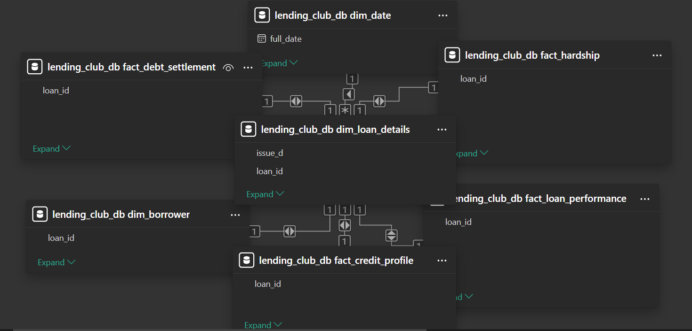

# 📊 Power BI System Documentation
## Credit Risk Intelligence Dashboard — Lending Club Portfolio (2007–2018)

**Analyst:** Oluwadunmininu Deborah Oluremi  
**Stack:** Power BI Desktop · MySQL 8.0 · DAX  
**Scope:** 2,260,668 accepted loan records · 27,648,741 rejected applications · 11-year portfolio history

> This document covers the full technical and design decisions behind the Credit Risk Intelligence Dashboard; from data modelling and DAX engineering to UI strategy and known limitations. It is intended to be read alongside the [root README](../README.md) which covers the upstream MySQL pipeline.

---

## 📑 Table of Contents

1. [Dashboard Pages](#dashboard-pages)
2. [Data Architecture & Modelling](#data-architecture--modelling)
3. [DAX Measure Library](#dax-measure-library)
4. [UI/UX Strategy & Design System](#uiux-strategy--design-system)
5. [Performance Tuning](#performance-tuning)
6. [Limitations & Assumptions](#limitations--assumptions)
7. [Access the Dashboard](#access-the-dashboard)

---

## Dashboard Pages

| Page | Analytical Focus | Preview |
|------|-----------------|---------|
| **1 — Executive Summary** | Portfolio-level KPIs, loan status distribution, acceptance vs rejection rate, issuance growth | [View](../Docs/dashboard_page1_executive_summary.png) |
| **2 — Risk Analysis** | Probability of Default (PD) by grade, FICO band, and DTI tier — the core credit risk stress test | [View](../Docs/dashboard_page2_risk_analysis.png) |
| **3 — Portfolio Trends** | Year-over-year default rate deterioration and loan issuance growth — the quality vs growth tradeoff | [View](../Docs/dashboard_page3_portfolio_trends.png) |
| **4 — Geographic Analysis** | State-level default rate heatmap revealing geography as an independent credit risk variable | [View](../Docs/dashboard_page4_geographic.png) |
| **5 — Borrower Profiles** | Side-by-side comparison of fully paid vs defaulted borrower profiles across 12 credit dimensions | [View](../Docs/dashboard_page5_borrower_profiles.png) |

The full static report is available as a PDF: [`credit_risk_dashboard.pdf`](credit_risk_dashboard.pdf)  
The interactive `.pbix` file is accessible via the [link at the bottom of this document](https://drive.google.com/file/d/1EXhHKF0aego8V5l4t9_ChtRmVX1H1qv4/view?usp=sharing).

---

## Data Architecture & Modelling

A dashboard is only as reliable as the model beneath it. 

I implemented a Star Schema to ensure high-performance filtering across a multi-million row dataset. This design minimizes the use of bidirectional filters, reducing memory overhead and preventing ambiguity in many-to-many relationships.


### The Semantic Layer

| Design Decision | Implementation | Rationale |
|----------------|----------------|-----------|
| **Fact-to-Fact Isolation** | `fact_loan_performance` and `fact_credit_profile` are separate tables | Separates realised financial outcomes from credit profile snapshots at origination. Prevents mixing of performance metrics with underwriting inputs. |
| **Date Dimension** | Dedicated `dim_date` calendar table (4,748 rows, 2007–2019) | Enables native Power BI Time Intelligence — YoY, MoM, and quarter comparisons without manual date logic in DAX. |
| **Analytical Flags** | `is_defaulted` and `is_concluded` integer columns on `fact_loan_performance` | Pre-computed in MySQL during cleaning phase. Eliminates repeated `CASE WHEN` logic in DAX and leverages the columnar storage engine for faster aggregation. |
| **Relationship Integrity** | All relationships enforced as foreign keys in MySQL before Power BI connection | Guarantees referential integrity upstream — Power BI inherits a clean model rather than compensating for data quality issues at the visualisation layer. |

### Model Diagram



---

## DAX Measure Library

All measures are **explicit** — defined once, reused consistently across all five pages. This eliminates the risk of the same KPI calculating differently on different pages due to implicit measure logic.

Measures are organised into four functional categories mirroring the analytical layers of a credit risk framework.

---

### 📌 Core Portfolio Volume
*Measures that establish the scale and composition of the lending operation.*

```dax
-- Total value of all funded loans across the portfolio
Total Portfolio Value = 
SUM('lending_club_db dim_loan_details'[funded_amnt])
```

```dax
-- Total number of approved and funded loan applications
Total Approved Loans = 
COUNTROWS('lending_club_db fact_loan_performance')
```

```dax
-- Total number of applications that were declined
Total Rejected = 
COUNTROWS('lending_club_db dim_rejected')
```

```dax
-- Total loans that have reached a final state (Fully Paid, Charged Off, or Default)
-- Active and late loans are excluded from this count
Total Concluded = 
SUM('lending_club_db fact_loan_performance'[is_concluded])
```

```dax
-- Approval rate as a proportion of all applications received
Acceptance Rate % = 
DIVIDE(
    COUNTROWS('lending_club_db fact_loan_performance'),
    COUNTROWS('lending_club_db fact_loan_performance') 
        + COUNTROWS('lending_club_db dim_rejected'),
    0
) * 100
```

---

### 🚩 Risk & Default Metrics
*The most business-critical measures. These separate active exposure from realised loss.*

```dax
-- Count of loans that defaulted, are charged off, or are 31-120 days late
-- Uses CALCULATE to apply filter context cleanly without FILTER() overhead
Total Defaulted = 
CALCULATE(
    COUNTROWS('lending_club_db fact_loan_performance'),
    'lending_club_db fact_loan_performance'[is_defaulted] = TRUE()
)
```

```dax
-- Default rate across the ENTIRE portfolio including active loans
-- Denominator: all loans ever issued
-- Use case: Portfolio-level risk exposure headline figure
Overall Default Rate % = 
DIVIDE(
    SUM('lending_club_db fact_loan_performance'[is_defaulted]),
    COUNTROWS('lending_club_db fact_loan_performance'),
    0
) * 100
```

```dax
-- Default rate among CONCLUDED loans only
-- Denominator: only loans that have reached a final state
-- Use case: True Probability of Default (PD) — the analyst's preferred metric
-- because active loans have not yet revealed their outcome
Concluded Default Rate % = 
DIVIDE(
    SUMX(
        'lending_club_db fact_loan_performance',
        INT('lending_club_db fact_loan_performance'[is_defaulted])
    ),
    SUMX(
        'lending_club_db fact_loan_performance',
        INT('lending_club_db fact_loan_performance'[is_concluded])
    ),
    0
) * 100
```

> **Why two default rate measures?**  
> The Overall Default Rate (12.86%) includes 878K active loans that have not yet resolved. The Concluded Default Rate (21.57%) isolates loans with known outcomes. For credit risk analysis, **Concluded Default Rate is the primary metric**. It is the closest approximation of true PD available from this dataset. Both are surfaced on the dashboard to provide full context.

---

### 💰 Financial Recovery & Loss
*Measures focused on capital preservation, Loss Given Default (LGD), and net exposure.*

```dax
-- Total principal recovered across all loans
-- Includes both scheduled repayments and post-default recoveries
Total Recovered = 
SUM('lending_club_db fact_loan_performance'[total_rec_prncp])
```

```dax
-- Net financial loss from defaulted loans
-- Calculated as: Amount Funded to Defaulters minus Principal Recovered
-- This is the portfolio's realised Loss Given Default (LGD) in absolute terms
-- RELATED() traverses the relationship to dim_loan_details to pull funded_amnt
Net Loss = 
SUMX(
    FILTER(
        'lending_club_db fact_loan_performance',
        'lending_club_db fact_loan_performance'[is_defaulted] = TRUE()
    ),
    RELATED('lending_club_db dim_loan_details'[funded_amnt])
        - 'lending_club_db fact_loan_performance'[total_rec_prncp]
)
```

---

### 📊 Borrower Credit Profile Benchmarks
*Averages used to establish baseline borrower characteristics and compare defaulted vs fully paid segments.*

```dax
-- Average FICO score at time of application across filtered context
Avg FICO Score = 
AVERAGE('lending_club_db fact_credit_profile'[fico_range_low])
```

```dax
-- Average Debt-to-Income ratio — NULL values excluded automatically by AVERAGE
-- 4,307 rows with invalid DTI were nullified during cleaning and do not affect this measure
Avg DTI = 
AVERAGE('lending_club_db fact_credit_profile'[dti])
```

```dax
-- Average annualised interest rate charged across the filtered loan set
Avg Interest Rate % = 
AVERAGE('lending_club_db dim_loan_details'[int_rate])
```

---

### 🧮 Calculated Columns
*Two calculated columns were added directly to `fact_credit_profile` to enable FICO and DTI band segmentation across all pages.*

```dax
-- Segments borrowers into standard credit score tiers
FICO Band = 
SWITCH(
    TRUE(),
    'lending_club_db fact_credit_profile'[fico_range_low] >= 800, "800+ Exceptional",
    'lending_club_db fact_credit_profile'[fico_range_low] >= 740, "740-799 Very Good",
    'lending_club_db fact_credit_profile'[fico_range_low] >= 670, "670-739 Good",
    'lending_club_db fact_credit_profile'[fico_range_low] >= 580, "580-669 Fair",
    "Unknown"
)
```

```dax
-- Segments borrowers into DTI risk tiers for comparative default analysis
DTI Band = 
SWITCH(
    TRUE(),
    'lending_club_db fact_credit_profile'[dti] = BLANK(), "Unknown",
    'lending_club_db fact_credit_profile'[dti] < 10,  "0-9% Low",
    'lending_club_db fact_credit_profile'[dti] < 20,  "10-19% Moderate",
    'lending_club_db fact_credit_profile'[dti] < 30,  "20-29% High",
    'lending_club_db fact_credit_profile'[dti] < 40,  "30-39% Very High",
    "40%+ Extreme"
)
```

---

## UI/UX Strategy & Design System

### Layout Philosophy
The dashboard follows the **F-Pattern reading model**. High-level KPI cards occupy the top row. The primary analytical visual anchors the top-left of each page. Supporting breakdowns flow down and to the right.

This layout ensures that a senior stakeholder glancing at the dashboard for 10 seconds extracts the headline finding. A analyst reviewing it for 10 minutes extracts the full story.

### Design System

| Element | Decision | Rationale |
|---------|----------|-----------|
| **Background** | `#0D1B2A` dark navy | Reduces eye strain during extended monitoring sessions. Makes white data labels and chart lines visually prominent. |
| **Card backgrounds** | `#1B2A3B` slightly lighter navy | Creates subtle visual separation between KPI cards and page background without using borders. |
| **Credit Loss colour** | `#E74C3C` red | Reserved exclusively for default rates, charged-off loans, and net loss figures. Never used for neutral or positive metrics. |
| **Capital Preservation colour** | `#2ECC71` green | Reserved for fully paid loans, recovery amounts, and positive trends. |
| **Warning colour** | `#F39C12` amber | Applied to late-stage loans and elevated-risk segments. |
| **Accent colour** | `#3498DB` blue | Used for volume metrics, trend lines, and interactive elements. |
| **Typography** | Segoe UI throughout | Native Power BI font — consistent rendering across all Windows environments without font substitution. |

### Categorical Grouping Strategy
Raw `purpose` values from the dataset were retained as-is in the database but grouped into broader **Strategic Business Units** in Power BI visuals for executive-level pages:

| Strategic Group | Underlying Purposes |
|----------------|-------------------|
| **Debt Financing** | debt_consolidation, credit_card |
| **Major Assets** | house, car, home_improvement |
| **Life Events** | wedding, medical, moving, vacation |
| **Business** | small_business |
| **Other** | educational, renewable_energy, other |

This grouping makes the Borrower Profiles page readable at a glance without losing the ability to drill into granular purpose-level data on demand.

---

## Performance Tuning

### Import Mode
All tables were loaded in **Import Mode** rather than DirectQuery. With 2.26M rows in the primary fact tables, DirectQuery would introduce query latency on every slicer interaction as Power BI would round-trip to MySQL in real time. Import Mode compresses data into the VertiPaq columnar engine, reducing the `.pbix` file size and enabling sub-second filter response.

### Data Type Optimisation
Verified and enforced correct data types in Power Query before load:

| Column Type | Storage Impact |
|------------|----------------|
| `is_defaulted`, `is_concluded` loaded as **Whole Number** | Fixed 8-byte integer. *Most efficient storage for binary flags* |
| `loan_amnt`, `funded_amnt` loaded as **Decimal Number** | Precision preserved without unnecessary float overhead |
| `issue_d`, date columns loaded as **Date** | Enables native date hierarchy without calculated columns |
| `grade`, `loan_status` loaded as **Text** | Categorical columns benefit from VertiPaq dictionary encoding |

### Measure Optimisation
Used `CALCULATE` over `FILTER` wherever possible for row-level filtering. `CALCULATE` modifies filter context using the internal storage engine optimiser. `FILTER` iterates row by row — acceptable for small tables but costly at 2M+ rows.

---

## ⚠️ Limitations & Assumptions

Transparency is part of rigorous analysis. The following limitations are acknowledged:

**1. 2017–2018 default rates are understated**
The concluded default rate for recent cohorts is artificially low because the majority of loans issued in 2017 and 2018 are still active. They have not yet reached a final state. As those loans mature, their true default rate will be higher than currently shown. The 28.58% figure for 2018 should be read as a lower bound, not a final figure.

**2. Geography analysis excludes low-volume states**
States with fewer than 1,000 total loans were excluded from the geographic default rate analysis to ensure statistical reliability. Small sample sizes produce volatile default rates that do not reflect true regional risk.

**3. DTI outliers were nullified**
4,307 rows with DTI values below 0 or above 100 were set to NULL during the MySQL cleaning phase and are excluded from all DTI-based analysis. Full details in [`docs/cleaning_log.md`](../docs/cleaning_log.md).

**4. Joint applications use primary applicant metrics**
For joint loan applications, only the primary applicant's FICO score and DTI are used in credit profile analysis. Secondary applicant data exists in the database but was not incorporated into dashboard-level aggregations.

**5. member_id was unavailable**
Lending Club stopped providing `member_id` in later data exports for privacy reasons. As a result, `dim_borrower` is structured one row per loan rather than one row per unique borrower. Repeat borrower behaviour cannot be analysed from this dataset.

---

## 🔗 Access the Dashboard

| Format | Access |
|--------|--------|
| **Interactive `.pbix`** | [Open in Power BI Desktop](https://drive.google.com/file/d/1EXhHKF0aego8V5l4t9_ChtRmVX1H1qv4/view?usp=sharing) |
| **Static PDF** | [`credit_risk_dashboard.pdf`](credit_risk_dashboard.pdf) |

**To run the `.pbix` file locally:**
1. Download and install [Power BI Desktop](https://powerbi.microsoft.com/desktop/) — free
2. Download the `.pbix` file from the link above
3. Open in Power BI Desktop
4. Go to **Home → Transform Data → Data Source Settings**
5. Update the MySQL connection to point to your local `lending_club_db` instance
6. Click **Refresh**

> The dashboard will fully populate once connected to a local MySQL instance running `lending_club_db`. All table relationships, measures, and calculated columns are embedded in the `.pbix` file and require no additional setup.

---

*Part of the Credit Risk Analytics project — [View full project documentation](../README.md)*
