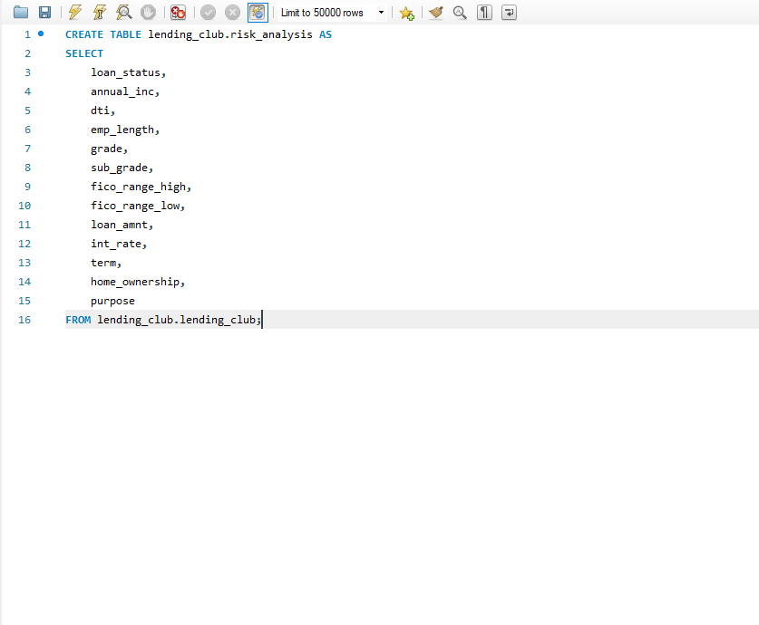
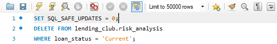
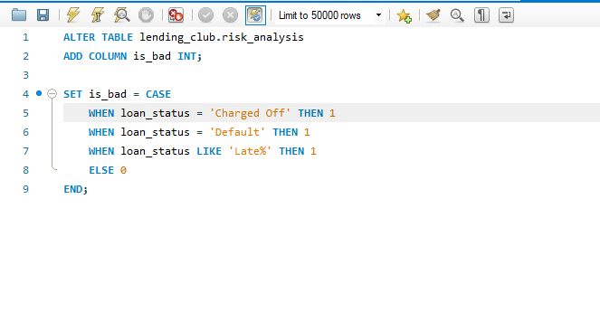
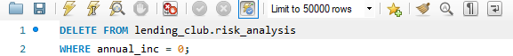
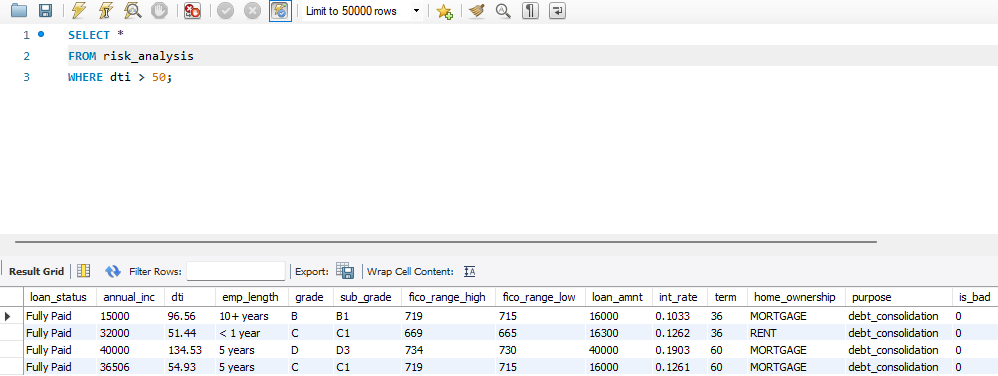

Here is the exact layout you should follow, including the specific headings and what goes inside them:
   
   
1. Project Title & Executive Summary
# LendingClub Risk-Returns Optimisation
  
Content: A 3-sentence summary. State the problem (defaults), your action (segmentation), and the result (reduced risk).
   
Why: Recruiters need to know the "value" immediately.
   
Title & High-Level Summary
What it is: A bold project title and a 2-3 sentence "elevator pitch."
   
The Goal: Tell the reader exactly what the project does in 10 seconds.
   
Senior Tip: Use the "Strategic Analysis" description we chose earlier.
   
2. Business Problem Statement  
## Quantifying the Risk-Return Threshold
  In the consumer lending sector, profit is dependent on the precision of the Risk-Return Tradeoff. A marginal increase in the default rate does not just impact interest income; it causes Capital Erosion, where the loss of principal requires significantly more performing loans just to break even.
   
  In high-volume lending, a Charged Off loan is a double loss: the bank loses the remaining principal and the operational cost of capital. Because principal losses are so much larger than interest gains, a 100 basis point (1%) reduction in the default rate can save millions in capital. This project focuses on identifying the risk tipping point where borrower leverage begins to outpace interest revenue.
   
   The ultimate objective is to move beyond simple yes/no credit decisions. By analysing the correlation between borrower capacity and loan outcome, this analysis provides a roadmap for risk-based pricing, ensuring the institution is adequately compensated for the risk it absorbs.
   
   3. Data Architecture & Governance   
   ## Heading: Data Pipeline & Governance
   
   Content: Mention the source (Kaggle) and your .gitignore strategy.
   
   Instruction: TAKE A SCREENSHOT of your organized folder structure (01_Raw, 02_Workbooks) and put it here.
   
   Why: This proves you are organized and understand data security.
   
   Data Source & Governance
   What it is: Where the data came from and how you handled it safely.
   
   The Goal: Prove you are a safe hire (mentioning the .gitignore goes here!).
   
   Content: Link to the Kaggle source and mention your cleaning steps.
   
   4. Methodology (The "ETL" Process)
## Technical Methodology: ETL & Data Transformation
To ensure the integrity of the risk scorecard, I implemented a robust Extract, Transform, Load (ETL) pipeline. The goal was to convert a high-volume, "noisy" dataset into a structured format capable of identifying default tipping points.

### 1. Extraction: Strategic Variable Selection

I extracted a specific subset of features based on the 5 C’s of Credit (Capacity, Capital, Character, Collateral, and Conditions).

* Target Metric: <kbd>loan_status</kbd> (The basis for the is_bad target variable).

* Capacity & Leverage: <kbd>annual_inc</kbd>, <kbd>dti</kbd>, and <kbd>emp_length</kbd>.

* Risk Character: <kbd>grade</kbd>, <kbd>sub_grade</kbd>, and <kbd>FICO ranges</kbd> (fico_range_high/low).

* Loan Terms: <kbd>loan_amnt</kbd>, <kbd>int_rate</kbd>, and <kbd>term</kbd>.

* Stability: <kbd>home_ownership</kbd>, and <kbd>purpose</kbd>.

### 2. Transformation: The Cleaning Logic
The transformation layer was executed using MySQL for structural changes and Power Query for reporting-layer logic:

* Scope Filtering: Removed rows where <kbd>loan_status</kbd> = current to focus exclusively on Terminated Loan Cycles (Fully Paid vs. Charged Off).

* Feature Engineering (is_bad): Created a binary classifier where 1 represents a financial loss and 0 represents a successful recovery.

* Anomalous Data Handling: * Removed records with zero or null annual_inc to prevent capacity deflation.

* Strategic DTI Audit: Retained high-DTI outliers (>50) after identifying a correlation with "Debt Consolidation" purposes and high success rates, preserving valuable high-yield data.

Dynamic Binning: Utilized Power Query to create Income_Buckets. This transformed a continuous numerical variable into categorical "Risk Zones" for clearer visualization.

3. Loading: The Reporting Layer
The cleaned, transformed data was loaded into Power BI via a flattened table structure.

Data Type Optimization: Ensured numeric values (Rates, Amounts) and categorical values (Grades, Buckets) were correctly typed to support DAX calculations.

Sort Logic: Created custom sort-order columns (e.g., Income_Sort) to ensure that the dashboard visuals followed a logical financial progression rather than an alphabetical one.
   
   
   
   5. Analysis & Key Insights
      ## Heading: ## Risk Segmentation & Financial Insights
   
   Content: This is the "meat" of the project.
   
   Insight 1: The correlation between FICO scores and default rates.
   
   Insight 2: The impact of DTI (Debt-to-Income) on repayment success.
   
   Instruction: TAKE A SCREENSHOT of your most impactful Pivot Table or Chart. Use "Conditional Formatting" (Red/Green) to make it look professional.
   
   Key Insights & Visuals
   What it is: The "Aha!" moments found in the data.
   
   The Goal: Prove you can translate numbers into Business Intelligence.
   
   Content: Embed screenshots of your charts and explain what they mean for the bank's profit.
   
   6. Final Recommendations (The "Senior" Part)
      ## Heading: ## Strategic Recommendations
   
   Content: Tell the "bank" what to do.
   
   "Restrict lending to Grade D borrowers with DTI > 35%."
   
   "Adjust interest rates for low-income segments to cover the 5% higher default variance."
   
   Final Recommendations
   What it is: Your advice to the company based on your findings.
   
   The Goal: Show Executive-level thinking.
   
   Content: "We should increase the interest rate for Grade D loans by 1.5% to cover the observed risk."
   
   ## Professional Formatting Tips
   Use Markdown: Use # for the main title and ## for sections.
   
   Bold Key Terms: Bold words like Default Rate, Risk Mitigation, and Power Query.
   
   Use Visuals: Never have more than two paragraphs of text without a screenshot or a bulleted list.
