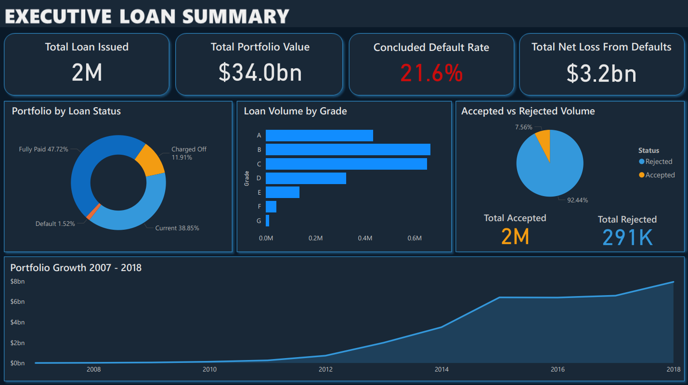
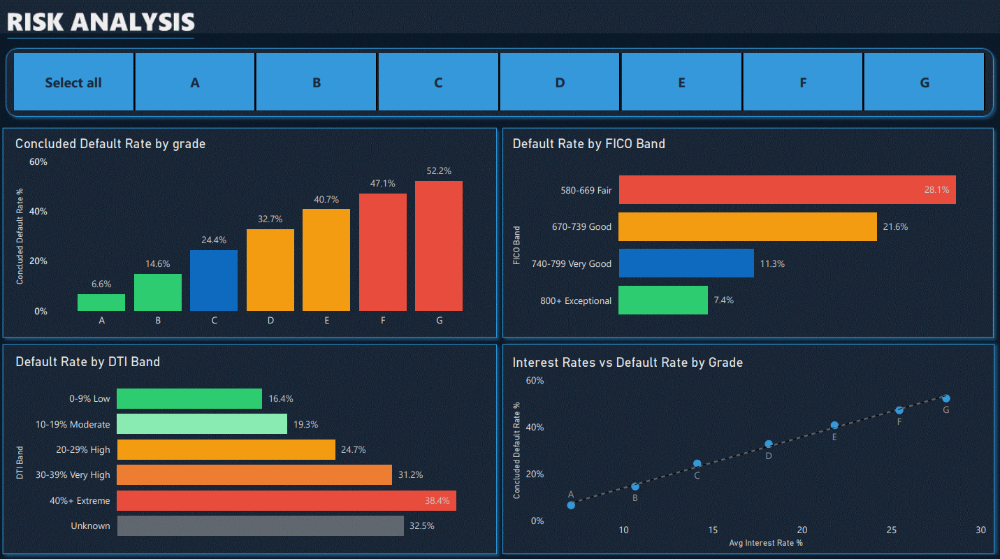
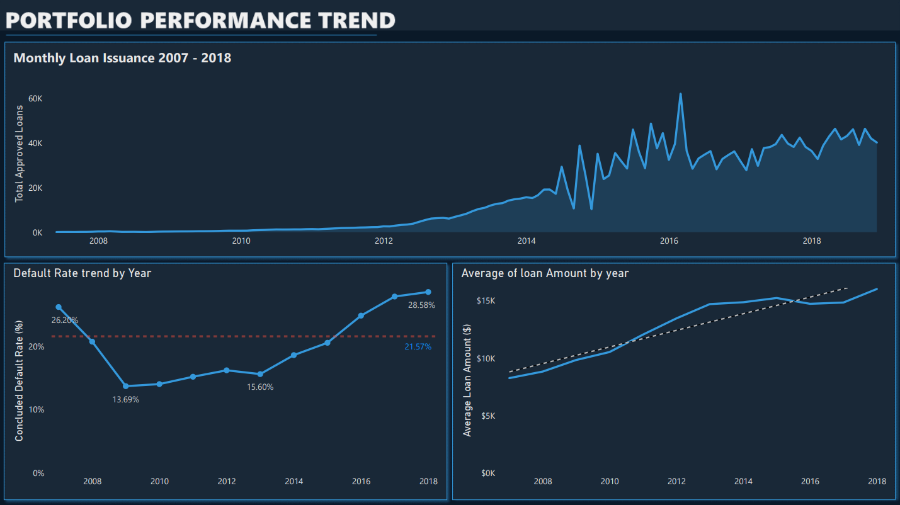
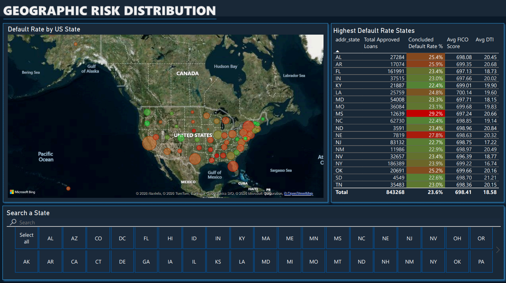
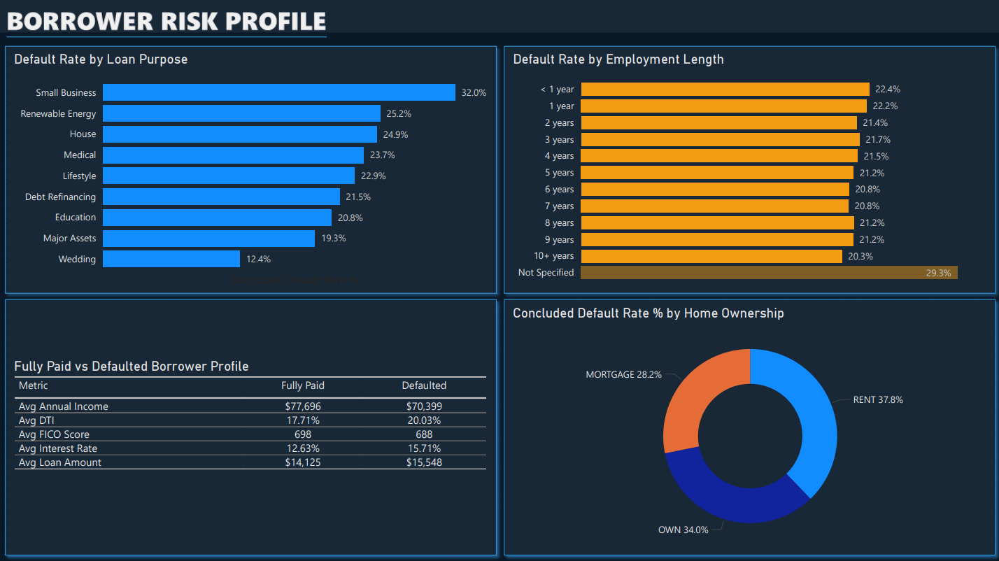

# Credit Risk Analytics — Lending Club Portfolio (2007–2018)
### Developed an end-to-end analytical pipeline on 29M+ record multi-source dataset to surface high-risk borrower clusters, model portfolio loss, and simulate institutional-grade risk reporting.


---

## 📑 Table of Contents

1. [Dashboard Preview](#-dashboard-preview)
2. [Executive Summary](#executive-summary)
3. [Key Findings](#-key-findings)
4. [Data Pipeline](#-data-pipeline)
5. [Project Navigation](#-project-navigation)
6. [Database Schema](#%EF%B8%8F-database-schema)
7. [Data Cleaning](#%EF%B8%8F-data-cleaning)
8. [Dashboard Pages](#-dashboard-pages)
9. [Risk Analysis](#page-2--risk-analysis)
10. [Portfolio Trends](#page-3--portfolio-trends)
11. [Geographic Analysis](#page-4--geographic-analysis)
12. [Borrower Profiles](page-5--borrower-profiles)
13. [Interactive Dashboard Access](#-interactive-dashboard-access)
14. [How to Reproduce This Project](#%EF%B8%8F-how-to-reproduce-this-project)
15. [Dataset](#-dataset)
16. [Author](#-author)

---
## 📊 Dashboard Preview

> **Executive Summary Page**: KPIs, default rate distribution, and issuance growth trend (2007–2018)



---

## Executive Summary

### The Business Problem
Credit lending institutions face a fundamental tension: **grow the loan portfolio aggressively, or preserve credit quality.** When that balance breaks down, default rates climb, capital erodes, and recovery becomes costly.

This project analyses the full Lending Club loan portfolio across 11 years to answer one central question:

> *Where is the risk concentrated, how has it evolved during aggressive growth, and which variables predict it?*

#### Key Intelligence Surfaced
- **Risk Stratification:** Default rates by Grade, FICO, and DTI.
- **Geographic Concentration:** Heatmaps of charge-offs by US State.
- **Loss Modeling:** Quantifying portfolio erosion and recovery rates.


### The Solution
Architected an analytics pipeline from raw CSV ingestion through a Star-Schema optimized MySQL warehouse to an interactive Power BI dashboard. The system surfaces:

- **Probability of Default (PD):** Risk stratification by grade, geography, and profile.
- **Loss Given Default (LGD):** Quantifying actual financial erosion.
- **Exposure at Risk:** Tracking portfolio health against aggressive issuance targets.

---


## 💡 Key Findings

- **21.57% Concluded Default Rate:** Identified that more than 1 in 5 loans reaching a final state resulted in a loss, signaling significant adverse selection issues within the underwriting process.

- **Quality Decay via Aggressive Growth:** Quantified a 2× deterioration in portfolio quality between 2013 and 2018. As annual issuance grew from 134K to 495K, the concluded default rate climbed from 15.60% to 28.58%—a textbook growth-versus-quality tradeoff.

- **Geography as an Independent Risk Driver:** Discovered that Mississippi borrowers defaulted at 29.25% versus 14.40% in Washington DC, despite near-identical FICO scores (697 vs 701). This proves geography acts as a primary risk variable often overlooked by standard credit models.

- **Negative Risk-Adjusted Return in Grade G:** Isolated the Grade G tier as an unprofitable segment. The 52.20% concluded default rate effectively erodes the 28.07% average interest yield, proving that current pricing does not adequately compensate for risk exposure in this bracket.

---

## 📐 Data Pipeline

```
Lending Club Raw Data          MySQL Workbench              Power BI Desktop
(Kaggle — 2 CSV files)  ──►   8-Table Star Schema   ──►   5-Page Dashboard
                               lending_club_db
  accepted: 2.26M rows    
  rejected: 27.6M rows         Staging → Clean →           Executive Summary
  152 columns                  Transform → Analyse          Risk Analysis
  1.55GB + 1.65GB                                           Portfolio Trends
                                                            Geographic Analysis
                                                            Borrower Profiles
```

**Pipeline Stages:**

| Stage | Action | Output |
|-------|--------|--------|
| **Ingest** | Loaded 30M+ records via `LOAD DATA LOCAL INFILE` into a staging table | `stg_accepted_loans` |
| **Model** | Designed and built 8-table star schema with enforced foreign key constraints | [`lending_club_db`](Docs/table_row_count.png) |
| **Clean** | Resolved 7 categories of data quality issues across 4 tables | [`cleaning_log.md`](Docs/cleaning_log.md) |
| **Analyse** | Wrote 10 business-driven SQL queries using CTEs, window functions, multi-table JOINs | [`sql/04_analysis/`](Sql/04_Analysis.sql) |
| **Visualise** | Connected Power BI to MySQL, built 13 DAX measures, delivered 5-page dashboard | [`credit_risk_dashboard.pbix`](Power_BI/credit_risk_dashboard.pdf) |

---

## 📂 Project Navigation

```
credit-risk-analytics/
│
├── 📄 README.md                        ← You are here
│
├── 📁 sql/
│   ├── 📁 01_schema/                   ← 10 table creation scripts
│   ├── 📁 02_data_import/              ← 9 data loading and population scripts
│   ├── 📁 03_cleaning/                 ← 7 targeted cleaning scripts
│   ├── 📁 04_analysis/                 ← 11 business analytical queries
│   ├── master_01_schema.sql            ← Full schema in one file
│   ├── master_02_data_import.sql       ← Full import pipeline in one file
│   ├── master_03_cleaning.sql          ← Full cleaning logic in one file
│   └── master_04_analysis.sql          ← All 10 analytical queries in one file
│
├── 📁 powerbi/
│   ├── README                          ← 6 core actions to create dashboard
│   └── credit_risk_dashboard.pdf       ← Static export for quick viewing
│
└── 📁 docs/
    ├── data_dictionary.md              ← Source data definitions and column guide
    ├── schema_reference.md             ← Full database schema with all columns
    ├── cleaning_log.md                 ← Every data quality issue found and resolved
    ├── analysis_insights.md            ← Business interpretation of all 10 queries
    └── [dashboard screenshots]         ← PNG previews of all 5 dashboard pages
```

---

## 🗄️ Database Schema

**Architecture:** Star schema — `dim_loan_details` as the central hub, all fact tables linked via `loan_id`.

| Table | Type | Rows | Description |
|-------|------|------|-------------|
| `dim_loan_details` | Dimension | 2,260,668 | Central hub for static loan terms, grade, purpose, issue date |
| `dim_borrower` | Dimension | 2,260,668 | Borrower demographics, employment, income, location |
| `dim_date` | Dimension | 4,748 | Calendar table to enables time intelligence in Power BI |
| `dim_rejected` | Dimension | 27,648,741 | Rejected applications: Risk score, DTI, state |
| `fact_loan_performance` | Fact | 2,260,668 | Loan status, payments, recoveries, default flags |
| `fact_credit_profile` | Fact | 2,260,668 | FICO score, DTI ratio, delinquency history, utilisation |
| `fact_hardship` | Fact | 832 | Loans placed on formal hardship programmes |
| `fact_debt_settlement` | Fact | 34,246 | Loans settled below full outstanding balance |

> **Transparency note:** 33 CSV footer rows appended by Lending Club were identified during foreign key validation and removed from all fact tables. These were summary rows, not loan records, and have zero impact on analysis. Full details in [`docs/cleaning_log.md`](docs/cleaning_log.md).

---

## 🛠️ Data Cleaning

Resolved **7 categories of data quality issues** before any analysis was performed:

| Issue | Table | Rows Affected | Resolution |
|-------|-------|---------------|------------|
| Blank employment length | `dim_borrower` | 222,556 | Replaced with `'Not Specified'` *preserved as risk signal* |
| Invalid DTI values (negative or above 100) | `fact_credit_profile` | 2,563 | Nullified and flagged via `dti_flag` column |
| Missing DTI values | `fact_credit_profile` | 1,744 | Flagged as `'Missing'` in `dti_flag` column |
| Verbose loan status values | `fact_loan_performance` | 2,749 | Simplified via `CASE WHEN`; `policy_exception` flag preserved |
| Empty loan status rows | `fact_loan_performance` | 33 | Set to `'Unknown'` *visible in dashboard, not silently dropped* |
| CSV footer rows in fact tables | All fact tables | 33 | Deleted using `REGEXP` pattern match on `loan_id` |


**Analytical flags added to `fact_loan_performance`:**
- `is_defaulted` — 1 if Charged Off, Default, or Late 31–120 days
- `is_concluded` — 1 if loan reached a final state (Fully Paid, Charged Off, Default)

> These flags power every default rate calculation in both SQL and Power BI without repeated `CASE WHEN` logic.

---

## 📊 Dashboard Pages

| Page | Business Question Answered |
|------|---------------------------|
| **1 — Executive Summary** | What is the overall health of the portfolio? |
| **2 — Risk Analysis** | Where is default risk concentrated by grade, FICO, and DTI? |
| **3 — Portfolio Trends** | How has loan volume and default rate changed year over year? |
| **4 — Geographic Analysis** | Which US states carry disproportionate default risk? |
| **5 — Borrower Profiles** | What separates a borrower who repays from one who defaults? |

### Page 2 — Risk Analysis


#### **Business Observations & Strategic Insights**

1. Non-Linear Risk Scaling (Default by Grade):

    - Observation: Default rates scale aggressively from Grade A (6.6%) to Grade G (52.2%).

    - Insight: The jump from Grade B to Grade C (~10% increase) represents a critical risk Threshold. This suggests that mid-tier underwriting criteria are significantly more volatile than top-tier segments.

2. The Credit Floor (FICO Band):

    - Observation: Borrowers in the fair FICO band (580–669) show nearly 4× the default risk (28.1%) of exceptional borrowers (7.4%).

    - Insight: While FICO is a primary predictor, the high default rate in the good category (21.6%) indicates that high-scoring borrowers are likely being over-leveraged by other external factors.

3. DTI as a Stress Predictor:

    - Observation: Default rates climb steadily as Debt-to-Income (DTI) ratios increase, peaking at 38.4% for extreme leverage (40%+).

    - Insight: The 16.4% default rate even in the low DTI (0-9%) segment suggests that income stability, rather than just the debt ratio, is a hidden risk factor.

4. Pricing-Risk Equilibrium (Interest Rate vs. Default):

    - Observation: The scatter plot shows a near-perfect linear correlation between interest rates and defaults.

    - Insight: While interest rates are rising to cover risk, the 52.2% default rate for Grade G against a ~28% interest rate proves that the portfolio is in a negative expected value state for bottom-tier loans. The yield does not cover the loss of principal.

#### **Strategic Recommendation**
Based on the Interest Rates vs. Default analysis, I recommend a complete strategic review of Grade F and G lending. The current interest rate premiums are insufficient to offset the capital erosion caused by >45% default rates. Moving forward, a tightened DTI cap (<30%) should be mandated for any borrower with a FICO score below 700 to mitigate these losses.

## Page 3 — Portfolio Trends


#### **Business Observations & Strategic Insights**

1. Hyper-Growth Phase (2014–2016):
    - Observation: Monthly loan issuance exploded from under 20K to a peak of over 60K in late 2015.

    - Insight: This period represents a massive market share grab. However, the high volatility (spiky peaks and valleys) suggests inconsistent underwriting volume or periodic tightening in response to capital constraints.

2. The Growth vs. Quality Trade-off:
    - Observation: The Default Rate Trend hit a historical low of 13.69% in 2009 but climbed steadily to 28.58% by 2018.

    - Insight: As the institution scaled, credit quality decayed. The portfolio is currently operating well above the 21.57% benchmark (the red dashed line), indicating that the aggressive growth strategy has significantly compromised the long-term health of the loan book.

3. Increasing Capital Exposure:
    - Observation: The Average Loan Amount has trended upward from roughly $9K in 2007 to over $16K in 2018.

    - Insight: The bank is not just lending to more people; it is lending larger amounts per borrower. When combined with the rising default rate, this creates a double jeopardy scenario where the Severity of Loss per default is increasing alongside the Frequency of Default.

4. Post-2016 Stabilization:
    - Observation: Issuance volume plateaued between 2016 and 2018, yet default rates continued to climb.

    - Insight: This suggests a lag effect. The "bad" loans originated during the 2015 hyper-growth phase are now reaching their "concluded" state (defaulting), proving that current portfolio pain is a direct result of past aggressive expansion.

#### **Strategic Recommendation**
The upward trajectory of the default rate even as issuance volume stabilizes, signals a maturing credit crisis. I recommend a portfolio contraction strategy: reducing average loan sizes for new originations and implementing a freeze on high-risk grade expansion until the default trend reverts to the 21.57% mean.

## Page 4 — Geographic Analysis


#### **Business Observations & Strategic Insights**

1. Geography as an Independent Risk Variable:

    - Observation: Mississippi (MS) shows the highest default rate at 29.2%, while states like New Jersey (NJ) sit significantly lower at 22.7%, despite both regions having near-identical average FICO scores (~698) and DTI ratios.

    - Insight: This disparity suggests that macro-economic factors such as state-level unemployment, cost of living, or local industry health are driving defaults more than individual creditworthiness. FICO alone is an insufficient predictor in high-risk regions.

2. High-Exposure Regional Clusters:

    - Observation: The Southeastern US (MS, AL, AR, LA) forms a distinct high-risk cluster with default rates consistently exceeding 25%.

    - Insight: The portfolio suffers from Geographic Concentration Risk. Economic downturns in these specific regions would disproportionately impact the bank’s total capital reserves compared to more resilient coastal hubs.

3. The Florida (FL) & New York (NY) Volume Trap:

    - Observation: Florida and New York represent massive loan volumes (161K and 186K loans respectively) with default rates hovering around 23.4% – 23.9%.

    - Insight: Because these states represent such a huge portion of the total portfolio, even a 1% increase in their default rates would result in millions of dollars in additional losses. These are systemically important states for the portfolio's stability.

4. Risk-Standardized Performance:

    - Observation: Nebraska (NE) shows a high default rate of 27.8% despite having one of the lower average DTIs (20.32).

    - Insight: This indicates that low debt does not guarantee low risk in certain jurisdictions. There may be underlying issues with loan purpose or employment stability unique to the Midwest corridor that the current model fails to capture.

#### **Strategic Recommendation**
I recommend implementing State-Specific Interest Rate Premiums. Borrowers in high-default states (MS, NE, AR) should be subjected to an additional geographic risk load to ensure the yield adequately covers the localized surge in default probability. Furthermore, the bank should cap new issuance in Mississippi until the local default rate reverts to the national 23.6% average.

## Page 5 — Borrower Profiles


#### **Business Observations & Strategic Insights**

1. High-Risk Loan Intent (Loan Purpose):
    - Observation: Loans for Small Businesses carry the highest default risk at 32.0%, followed by Renewable Energy and Housing.

    - Insight: Small business loans are notoriously volatile as they rely on the borrower's entrepreneurial success rather than a steady salary. Interestingly, Weddings show the lowest risk (12.4%), suggesting a higher social or personal commitment to repayment for life-event financing.

2. Employment as a Stability Proxy:
    - Observation: Default rates are relatively flat across most employment lengths (~21%), but spikes to 29.3% for those who did not specify employment.

    - Insight: The "Not Specified" category is a major red flag. This indicates that Data Completeness is a risk predictor in itself. Borrowers who cannot or will not verify employment details are significantly more likely to default.

3. Home Ownership & Skin in the Game:
    - Observation: Renters have the highest default rate (37.8%), while those with mortgages are the most stable (28.2%).

    - Insight: Homeowners (especially those with mortgages) have skin in the game and likely better access to secondary credit lines (like HELOCs) to avoid default during temporary financial hardship. Renters are more transient and lack this collateral-based safety net.

4. The Anatomy of a Default:
    - Observation: Comparing Fully Paid vs Defaulted reveals that the average defaulter has a $7k lower income, a 3% higher DTI, and a 10-point lower FICO score.

    - Insight: No single metric is a smoking gun, but the combination of slightly lower income and higher interest rates (15.71% vs 12.63%) creates a compounding pressure that leads to failure. Defaulters are being squeezed by higher costs and lower resources.

#### **Strategic Recommendation**
I recommend a Risk Premium or stricter verification for Small Business and Debt Refinancing loans. Furthermore, the bank should implement a mandatory employment verification policy; the 8% risk premium associated with "Not Specified" employment suggests that unverified income is a primary driver of preventable portfolio loss.

---

## 🔗 Interactive Dashboard Access

The `.pbix` source file exceeds GitHub's file size limits and is excluded from this repository.

**To access the interactive dashboard:**

> 📥 [**Download credit_risk_dashboard.pbix**](https://drive.google.com/file/d/1EXhHKF0aego8V5l4t9_ChtRmVX1H1qv4/view?usp=sharing)*

**To open it locally:**
1. Download and install [Power BI Desktop](https://powerbi.microsoft.com/desktop/) — free
2. Download the `.pbix` file from the link above
3. Open in Power BI Desktop
4. The dashboard will load with full interactivity — slicers, drill-throughs, and tooltips included

Alternatively, the static PDF export is available at [`powerbi/credit_risk_dashboard.pdf`](powerbi/credit_risk_dashboard.pdf).

---

## ⚙️ How to Reproduce This Project

### Prerequisites
- MySQL 8.0+ with MySQL Workbench [*Download Here*](https://dev.mysql.com/downloads/workbench/)
- Power BI Desktop (free) [*Download Here*](https://powerbi.microsoft.com/desktop/)
- ~10GB free disk space for raw data

## Tools Used
| Tool | Purpose |
|------|---------|
| MySQL Workbench | Database design, data import, cleaning, analysis |
| Power BI Desktop | Interactive dashboard and visualisations |
| VS Code | Script editing and project documentation |
| GitHub | Version control and project portfolio |

### Step 1 — Get the Data
Download the Lending Club dataset from [Here](https://www.kaggle.com/datasets/wordsforthewise/lending-club)

Place both CSV files in `Data/Raw/`:
```
Data/Raw/accepted_2007_to_2018Q4.csv
Data/Raw/rejected_2007_to_2018Q4.csv
```

### Step 2 — Build the Database
Open MySQL Workbench and run the master scripts in order:

```sql
-- 1. Create database and all 8 tables
SOURCE sql/master_01_schema.sql;

-- 2. Load raw data and populate all tables
SOURCE sql/master_02_data_import.sql;

-- 3. Clean and prepare data for analysis
SOURCE sql/master_03_cleaning.sql;

-- 4. Run all 10 analytical queries
SOURCE sql/master_04_analysis.sql;
```

> **Note:** The data import step will take 20–40 minutes depending on hardware.
> Ensure `local_infile` is enabled: `SET GLOBAL local_infile = 1;`
> Update file paths in `master_02_data_import.sql` to match your local directory.

### Step 3 — Open the Dashboard
1. Download the `.pbix` file from the link in the Interactive Access section above
2. Open in Power BI Desktop
3. Go to **Home → Transform Data → Data Source Settings**
4. Update the MySQL connection to point to your local `lending_club_db` instance
5. Click **Refresh** — the dashboard will populate with your data

---

## 📋 Dataset

| File | Records | Size | Coverage |
|------|---------|------|----------|
| `accepted_2007_to_2018Q4.csv` | 2,260,701 | 1.55 GB | All funded loans |
| `rejected_2007_to_2018Q4.csv` | 27,648,741 | 1.65 GB | All rejected applications |

**Source:** [Lending Club Loan Data — Kaggle](https://www.kaggle.com/datasets/wordsforthewise/lending-club)

> Raw data files are excluded from this repository due to size.
> The `.gitignore` explicitly excludes all `.csv` files in `Data/Raw/`.

---

## 👤 Author

**Oluwadunmininu Deborah Oluremi**

Data Analyst | FinTech

[](https://www.linkedin.com/in/dunmininu/)
[](mailto:oluremid44@gmail.com)
